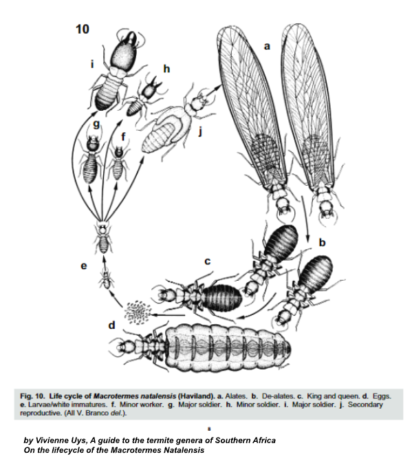
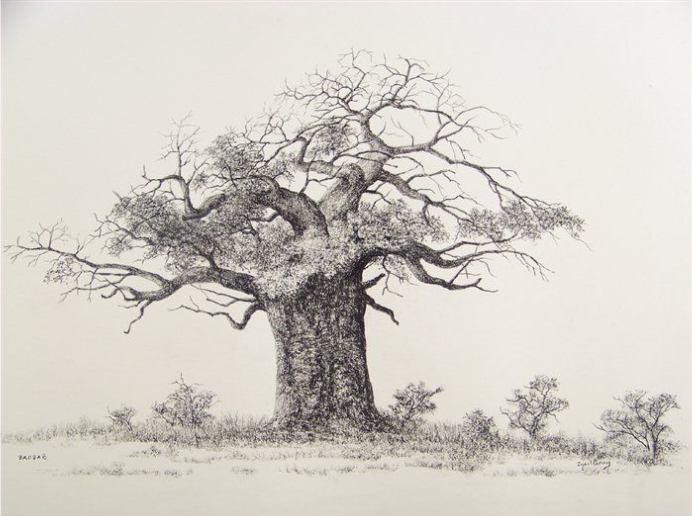
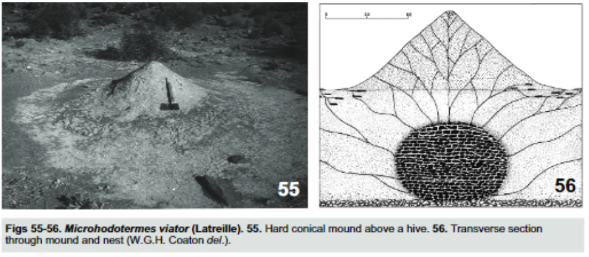
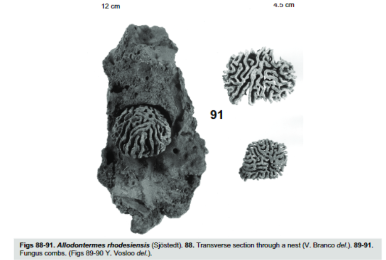

# Prologue: Termythos.
How the red chested cuckoo got its call, a parable transcribed by travelling ministers

---
*DIRECTOR'S CUT v2 — incorporates writer notes + Pass One feedback*
*Storm resistance + cloud parallax: page load → 🌩🌩🌩*
*Bush ambience: enters after reboot, runs through absorption section*
*Pixel termite system: all paragraphs from alates section to end*
*Claude API message: assembles at bottom, persists*
*Cuckoo call: plays on "Ah zee bo?"*
---

> [CUT: SOUND | auto | low continuous thunder undertone — single deep rumble every 8s, barely audible, volume increases slowly as reader descends | NEEDS: thunder-loop.mp3 — CC0, ~30s loop. Source: freesound.org or Web Audio API synthesis]
> [CUT: VISUAL | auto | dark storm cloud layer renders behind text — 2–3 large blurred shapes moving left-to-right at 60% of scroll speed (parallax). Near-black (#0a0d08) mass forms. Mountain-sized. Should feel like weather pressing down, not decoration. | NEEDS: CSS/canvas animation, no external asset]
> [CUT: SCROLL | auto | scroll resistance active — subtle. Reader pushes against the page. Resistance scales with scroll speed: faster scroll = more resistance. | NEEDS: JS wheel/touch event intercept, no asset]

In the drylands, they get summer storms. Not the pitter patter playing of rolling white clouds- but heavy drops from mountain sized things. It's these angry black clouds that have it in them to cross deserts- and it's these angry clouds that bring wind and hail and electric.

Electric flashes across the dark floating cliffs and in the distance clouds trace a slow explosion across the world. Where they walk, the world is replaced by flying oceans. Heavy drops drum against the earth. These giants have rained for days and will do so for weeks. There is no slow start. No drip drop drip. Instead there is a torrent, all at once. Enveloping the world.

> [CUT: SOUND | scroll-enter | thunder doubles in volume — now clearly a storm, not an undertone. Rumble frequency increases. | same loop, JS volume ramp]
> [CUT: VISUAL | scroll-enter | cloud layer darkens and accelerates slightly — storm is directly overhead | CSS]

Lights flash again. This time they are accompanied. This time there follows an almighty crack. Violence against the laws of nature. The world has unsealed, forced aside by the plasma whip cracked through the air. In its place is a river of vacuums. A crack in the world. And from the cracks crawl all manner of things.

Fat and greasy wings appear from pin-sized holes in the earth.

These wings belong to the alates, the winged caste of the termite. They were bred to spread wings and then genetics, in that order. To fly then fuck. They won't help build or fight or farm.

Their entire lives they are spoiled by the labours of their betters and given everything they could ever want. Then they are asked to leave.

Worth it.

When they leave, they squeeze through tunnels too small for their waxen wings. They pop from the mounds that made them; to dance an otherworldly dance. The sky is coloured grey in a mess of wings as swarms of fat little bodies fly underneath long gone clouds. The angry clouds have raged ahead, replaced by clouds of the clumsy first time fliers.

Their wings are detachable, meant to fall off after their maiden journey, so as to facilitate burrowing, but the wings malfunction more often than not, and the alates flail with one wing attached, one wing off. Easy prey. They will die as surely as the clouds that came before them. These termites make for poor mates, but are an excellent distraction. Their more successful peers will seed new mounds, underneath the thousands upon thousands of dead strewn across the wet bush.



---

> [CUT: SOUND | scroll-enter | THUNDERCRACK — single, immediate, violent. No fade in. Cuts through everything. | NEEDS: thunder-crack.mp3 — sharp single strike, not a rumble. Source separately from loop.]
> [CUT: VISUAL | scroll-enter | screen flashes white (0.1s) → cuts to absolute black. Black holds for 2 full seconds. All text gone. Clouds gone. | CSS keyframe]
> [CUT: SCROLL | scroll-enter | scroll resistance drops to zero during black hold | JS]
> [CUT: TEXT_FX | scroll-enter | after black: text reboots. Each paragraph fades in sequentially, top to bottom, 150ms apart. Slight stutter on first character of each line — not typewriter, just a brief opacity flicker, like a cold start. Background stays flat dark. New world. | JS + CSS]
> [CUT: SOUND | scroll-enter | thunder loop fades out over 3s during black hold. Gone by the time text reboots. | JS volume fade]

🌩🌩🌩

---

> [CUT: SOUND | scroll-enter | bush ambience fades in slowly — 4s fade. African night/dusk soundscape: insects, distant birds, dry air. Continuous from here through the absorption section. Quiet. Under everything. | NEEDS: bush-ambience.mp3 — source from https://www.youtube.com/watch?v=nydpsKVEYwE — needs downloading as audio file, trim to clean loop, ~60s]

Azibo knew about alates. He knew almost everything about termites. He knew about how the queens were too fat to move, because they had to lay an egg once every three breaths. He knew that termites did not eat wood, but fermented it in underground farms. He knew about architecture, agriculture, engineering and airflow. He was tutored by the little red spires, the termite mounds that littered the bushveld.

As a child, he would not play or help farm. Instead he spent his time peering into the spiralling tunnels that bored into the earth. His brothers and sisters would break open a mound for dinner, and he would stay for hours, studying the curious things.

This strange behaviour did not go unnoticed by his mother, who, too with an observant manner, picked up on it while he was young.

She went to the market square and in conversation asked an old woman if her son would be alright. The old woman, having lived a worthless life, sensed an opportunity to finally appear useful. She gave advice she had no right to. That Azibo was somehow wrong or strange or bad for his differences and that he should be 'corrected'. She said it with a worthless confidence, which is way more convincing than any worthwhile doubt.

His mother thought about what the old lady had said, but his mother was wise for one so young. She decided that even though Azibo was strange, it did not make him evil. Sure Azibo acted nothing like his boisterous sisters or brothers, but that's why she liked him. Instead the boy was calm, analytical, polite and gentle. He was a strange boy, but except for the obsession, he was strange in all the right ways.

The rains came and went, and Azibo grew older and stranger. At the age where boys' eyes would open to the women around them, his did not. He would only sit next to a mound, peering at the movements of the colonies. When his sociable and popular mother would meet with other women from the village, they all agreed that the boy needed the love of a woman. Perhaps the priestess could help. This niggled at Azibo's mother until she was eventually convinced by the tuts of her unapproving friends.

In those days Azibo's people had strong medicine, practised by a powerful sorceress. She lived in the roots of a great dead baobab. To speak to her, one had to crawl, belly to soil, through a small opening in a hollow trunk. Once in the tree, one would whisper prayers to the sky god and his priestess would translate.



Azibo and his mother went there to pray for advice. They got down on their bellies, intending to crawl headfirst into the narrow roots. Azibo went first, and once he was ankle deep in the dead tree, his mother climbed into the root. As they squeezed into the mouth of the tree, Azibo's mother saw Azibo kick and squirm. A snake was swallowing the boy whole! His mother got out and heaved bodily at her son, yanking him free from the predator. The huge snake appeared and before they could scream or yell or run, the snake was gone and had turned into a stately old woman.

Azibo stared at the woman brushing the dust from her muscled body. She turned to Azibo and he could see the bright sun bouncing off her milky white eyes, blind to all but the gods. The woman spat at his feet. A curse in any land.

"You who the sky god cannot see, you carry a curse. Leave this soil lest you taint it!"

Azibo and his mother, still terrified of the great snake, listened and left that place, but this "curse" did not bother Azibo, he was happy. After that day Azibo and his mother agreed that there was no elder worth listening to. Not even the gods.

A day came when Azibo could learn no more of termites, for even their language had become known to him. So it was that Azibo learned the chittering tongue of the earth. The other boys grew to marrying age, but Azibo only ever spoke to the mound or to his mother. Sometimes he would accidentally chitter scents at her. Accustomed to the tongue that the mound had taught him.

Even his dreams were spent at the mound. At night his mind wandered there and his sentience was grafted to it. He flexed his arm and a hundred little soldiers moved to defend a breach. He wriggled his toes and dozens of eggs were carried to mega-nurseries. Optimisations stretched ahead of him and the mound was always eager to ask his advice on the next most important thing. He spent days, then weeks, dreaming of helping the mound, and the termites listened, trusting the child's wisdom. Together the child and the hive grew strong and wise.

When the digging stars peeked over the horizon in his fourteenth year, Azibo was finally allowed to lift his curse and become a man. The rituals would cleanse him and he would shed the cursed boy, like the snake does its old skin, but… the rituals would not come until after the storms had passed.

> [CUT: SOUND | scroll-enter | a single low thunder pulse — one rumble, 2 seconds, then gone. Reminder. The storm is not far. | thunder-loop.mp3 single burst at low volume, JS]

And when the electric stings, the termites grow wings.



---

> [CUT: TEXT_FX | scroll-enter | PIXEL TERMITE SYSTEM ACTIVATES. Canvas overlay above ALL remaining text from this point to end of story. Pixels begin detaching from letters across every paragraph — 1px amber (#d4a843) dots walking downward with erratic insect motion. Starts sparse: ~5% of letter pixels per paragraph. Cumulative — each new paragraph the reader enters has slightly more loss than the last. By the absorption section, letters are 60–70% hollow. Text remains legible throughout but feels like it is being consumed. | NEEDS: canvas pixel-agent system — see CODER BRIEF]
> [CUT: SOUND | scroll-enter | faint termite chittering begins under the bush ambience — dry clicks, high frequency, barely audible. Like something is very close. | NEEDS: termite-chitter.mp3 or Web Audio API synthesis — filtered white noise, high freq bursts]

As the storm broke late at night Azibo awoke suddenly and found that he couldn't see or breathe or think. He was so between man and mound that the mound and the man confused themselves. With great urgency, a pressure built in his throat, nose and ears. Panic saved him and ripped him upright.

In seconds he was half lying half sitting with his body twisted to the ground. His left hand held him upright while his right fished in a dry mouth. Fingers felt clumsily until a desperate hand grabbed hold of wax-like wings and in one swift movement he flicked the thing to the floor. Alates.

His frantic digging was for a need to inhale, but his body would not let him. Not with so many fat little bodies in the way. Azibo flipped onto his knees and tried to relax, feeling the little legs crawl across the soft tissue inside his skull.

The first wings started spreading on the lip of his nostrils and then at the back of his tongue. The body gagged and mucus forced the things out, but his pain did not subside. Once he could breathe, he stared in terror at the burning pain between his legs as more alates squeezed themselves from his penis and rectum.

> [CUT: TEXT_FX | scroll-enter | pixel loss ACCELERATES sharply across this paragraph and all following — now 40–60% of letter pixels walking. Letters look like they are being eaten mid-sentence. | canvas system intensity ramp]

Terrified, the boy yelled and begged the mound to release him from her. She had sent alates through his holes in her dream. Scared of losing the boy, the mound apologised mournfully. It was saddened that it had hurt the boy. She promised to never harm him again and Azibo, kind hearted, tried to understand.

The next day came and the other boys were sent to become men. Azibo was not allowed. The sky god's priestess had refused him.

Azibo was hurt to his core. He wanted to be a man with his whole being. It was the men that could help the tribe and earn respect and titles. He wished to be a man to help the world care for each other. As the organisms of the mound did. If only the village would listen to his advice like the mound did!

"You cannot! You will never be a man. I promise you that" The mound whispered to him.

Azibo grew angry, angry enough to ignore the mound. He was still hurt from her dream and so it was easy to shut her out completely. For a whole year he did not speak to it, nor did he dream of it. He had stopped speaking the language that gave him that power.

Instead he spent his time helping his elders. He did not ask for payment or gain. He only wished to improve the lives of those around him. If he could not help as a man, he would do so as a boy. First it started slow. He planted seedlings for an old lady to help her block the floods. This was a trick the termites had taught him. Thereafter, Azibo showed another old man how to dig trenches that would water the lands and relieve the floods. Another engineering of the insects. The next year, when it flooded, it was only those that Azibo had helped who had had a strong harvest.

This gained him influence.

Another year passed and more boys were sent to become men. Azibo was not allowed. It did not matter to him anymore, because he had promised that he would fix an old man's roof that day.

All his little improvements fed each other, until the village grew powerful. Their yields overshadowed those of other tribes and every market day was a new opportunity for Azibo's people to show off. His mother was very proud of her cursed boy!

The mound took note of its prodigy's progress. It saw the boy for what he was, for what his people never could. The boy was special and clever and the mound was jealous. It made a plan to get back its son, for even Azibo's name meant earth.

The hive sent alates to build a mound underneath Azibo's bed. A small mound that would whisper to him at night. It reminded him how to listen for the meaning behind the chittering and after weeks Azibo began to understand enough to once again dream of the mound, of her.

The mound had gotten to know Azibo very well and it knew exactly how to seduce him. She sent him flickers of the globe and of all the suffering people the world over. Going outwards Azibo understood first hundreds, then thousands, then millions of people's suffering, then billions. The great horror of humanity became more wriggly and retched than any termite mound. Azibo saw all the children dying of hunger, all the brothers fighting for food. All the rape and murder and chaos. His tears rivered into the soil.

Exasperated, Azibo spoke to the mound for the first time in years. He begged the mound to teach him how to help more people. How he could ever hope to save so many.

The mound was cunning and it told Azibo that it knew of a way. That Azibo only had to come and listen, and then he would know it too. So the boy awoke and left his mother sleeping. He was not a man and could not get a wife, but his mother had never deserted him. She had always seen the boy for his good heart and better mind. He said a prayer to the sky god, thanking him for his mother and ran to the mound.

There he begged for a way to help all the people that needed it.

The mound told him that what he was describing was not the power of a man, but of a conqueror. "Listen close," the mound whispered.

It whispered very softly, too softly for Azibo to hear well. Years of neglect had stolen the language from his head and he had to lean in very close to feel the chittering. He pressed his ear tight to the earth. As Azibo lay there the mound told him a very long story. The story started with Azibo, who would not become a man. It told him how parents warned their children to keep away from the cursed boy. How he would never be trusted by his own people, nor the neighbouring tribes. It spoke to him of other cursed children, each tale more enthralling than the last.

The mound told him of conquerors, who were cursed by millions for their powers. For their knowledge. For their wisdom. They were cursed many times over.

The mound explained that the first curse hurt, but that the hundredth one helped. That the people in the stories were cursed not once, but thousands of times. Every curse feeding them. Every new curse was a victory over a new enemy, and a thousand curses were necessary for a million blessings.

So the mound seduced the clever boy.

The mound was a powerful orator and the story was long and well told. It so entranced Azibo that the termites could build upon him. He kept listening to its stories and the mound grew up his nose and down his throat. The insects tunnelled into skin and hollowed out his bones, all without his notice. When Azibo had listened for two weeks, he finally started to grow thirsty, but he could not speak or move. He could only lie still and feel all the little termites walking across his nerves and in his skin. It was too late. The termites had built all around him and all throughout him.

> [CUT: TEXT_FX | scroll-enter | this line typewriters in — character by character, ~40ms per character, no cursor. After the full line renders, the text color fades from amber (#d4a843) to white over 3s. The words disappear. The background stays dark. The line is gone. | NEEDS: JS typewriter + CSS color transition]
> [CUT: TEXT_FX | scroll-enter | simultaneously: pixel agents that accumulated from this line walk to bottom of viewport and begin assembling the Claude-generated message | canvas + API, see CODER BRIEF]

Only one ear was left exposed, as punishment for not listening to the mound for those three years.



> [CUT: SOUND | scroll-enter | bush ambience fades out slowly — 6s. Chittering stops. Silence. | JS volume fade]

The mound made him listen now, night after night, as his mother called for him. Every night she called. When she could do so no longer, she pleaded with the snake sorceress of the sky god.

But the priestess, dismayed, told her again that the sky god was blind to the boy and always had been. That his curse had finally taken root.

Desperate, his mother asked to become a bird, so she could look for the boy herself and the sky god obliged, turning her into a small red bird.

She flew across the sky, calling his name wherever she went.

> [CUT: SOUND | scroll-enter | red-chested cuckoo call plays. Full volume. Clean. Nothing else. Loops 3 times, then fades over 4s. | NEEDS: cuckoo-call.mp3 — clean recording of red-chested cuckoo (Cuculus solitarius). Reference: https://www.youtube.com/watch?v=BYb5PMhr6Aw — source as proper audio file, not YouTube embed]
> [CUT: PAUSE | auto | nothing animates during the call. Termites are still. Text is still. Just the bird. | no asset]

"Ah zee bo?"
"Ah zee bo?"
"Ah zee bo?"

> [CUT: TEXT_FX | scroll-enter | final line fades in over 3s. Amber. Alone. | CSS opacity transition]
> [CUT: PAUSE | auto | after line appears: 5 seconds of nothing. No scroll indicator. No animation. Page simply ends. Reader has to decide when to leave. | no asset]

This is how the red chested cuckoo learned its call. A bird, looking for the earth.

---

## NEEDS SUMMARY

| # | Asset | Type | Notes |
|---|-------|------|-------|
| 1 | `thunder-loop.mp3` | Audio | Low rumble, ~30s loop, CC0 — freesound.org |
| 2 | `thunder-crack.mp3` | Audio | Single sharp strike — source separately |
| 3 | `bush-ambience.mp3` | Audio | Source from https://www.youtube.com/watch?v=nydpsKVEYwE — download, trim to clean 60s loop |
| 4 | `termite-chitter.mp3` | Audio | Dry high-freq clicks — OR synthesise with Web Audio API (filtered noise bursts) |
| 5 | `cuckoo-call.mp3` | Audio | Red-chested cuckoo — ref: https://www.youtube.com/watch?v=BYb5PMhr6Aw — source clean recording |
| 6 | Storm cloud layer | Code | CSS/canvas parallax animation — no external asset |
| 7 | Pixel termite agent system | Code | Complex — see CODER BRIEF A |
| 8 | Claude API message | Code | Requires serverless proxy — see CODER BRIEF B |
| 9 | 4× placeholder images | Art | Leave as-is for now |

---

## CODER BRIEF A — PIXEL TERMITE AGENT SYSTEM

**Scope:** Canvas overlay covering all text from the alates section to end of page.

**How it works:**
1. Each `<p>` in the affected zone is rendered to an offscreen canvas via `html2canvas` or manual text rendering
2. Pixel positions of rendered characters are sampled
3. Agents (termites) spawn at those positions — 1×1 or 2×2px amber (#d4a843) dots
4. Each agent: random walk with strong downward bias (gravity ~0.3), horizontal bursts (5% chance per frame), speed 0.5–1.5px/frame
5. As agents leave, source pixels fade (letter becomes hollow)
6. Agents accumulate in a fixed zone at the bottom of the viewport

**Escalation curve:**
- First paragraph after activation: ~5% pixel loss
- Each subsequent paragraph: +8–10% more loss
- Peak (absorption section): ~65–70% loss — legible but degraded

**Agent destination:** Bottom holding zone. Agents mill around until the "Only one ear" line triggers assembly.

**Assembly trigger:** On scroll-enter of "Only one ear" line — agents stop milling, begin walking into letter positions to form the Claude-generated message. Assembly takes 3–4s. Message persists for rest of page.

---

## CODER BRIEF B — CLAUDE API CREEPY MESSAGE

**The problem:** GitHub Pages is static. API keys cannot be exposed client-side.

**Solution:** A Netlify/Vercel/Cloudflare Worker serverless function acts as proxy.
- Client collects fingerprint data, POSTs to `/api/termite-message`
- Function calls Claude API with that data
- Returns generated message string
- Client assembles it via termite agents

**Fingerprint data to collect (all browser-safe, no privacy violation):**
```js
{
  visits: localStorage.getItem('azibo_visits') || 0,  // increment on load
  hour: new Date().getHours(),
  timezone: Intl.DateTimeFormat().resolvedOptions().timeZone,
  referrer: document.referrer || null,
  language: navigator.language,
  width: window.innerWidth,
  height: window.innerHeight,
  colorScheme: window.matchMedia('(prefers-color-scheme: dark)').matches ? 'dark' : 'light'
}
```

**Claude prompt (sent server-side):**
```
You are the termites. You have been walking through this person's machine.
You found the following:

- They have visited this place {visits} times.
- It is {hour}:00 in {timezone}.
- They came from: {referrer || "nowhere. they came from nowhere"}.
- They speak {language}.
- Their window is {width}×{height}.
- They prefer the {colorScheme}.

Write 4–6 short lines that the termites would assemble on the page.
Each line should feel like something you shouldn't know.
Tone: quiet. Matter-of-fact. Not threatening. Just aware.
Use the data but don't just list it — transform it into something stranger.
No punctuation at the end of lines. Lowercase only.
```

**Re: googling the person:** Not feasible from browser or serverless without a search API key and the person's name (which we don't have). But the prompt above is designed to make it *feel* like you've been researched, without actually doing so. The psychological effect is the same.

**Output format:** Plain text, one line per termite message line. Assembled left-to-right, letter by letter, by the agents.
